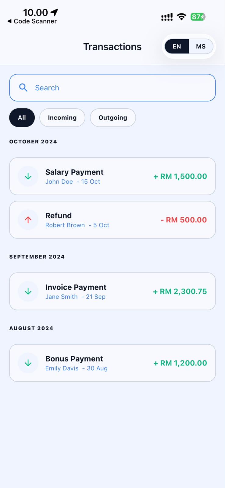
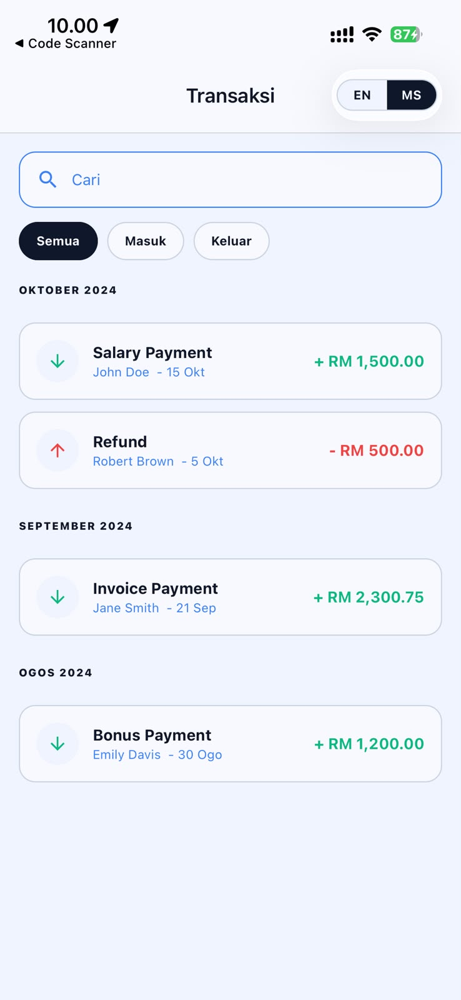
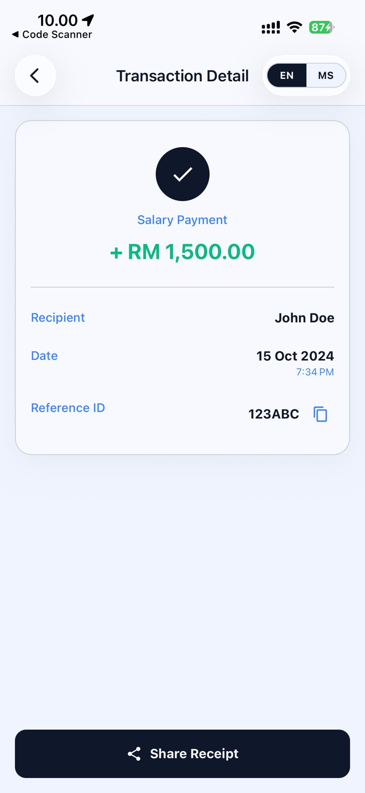
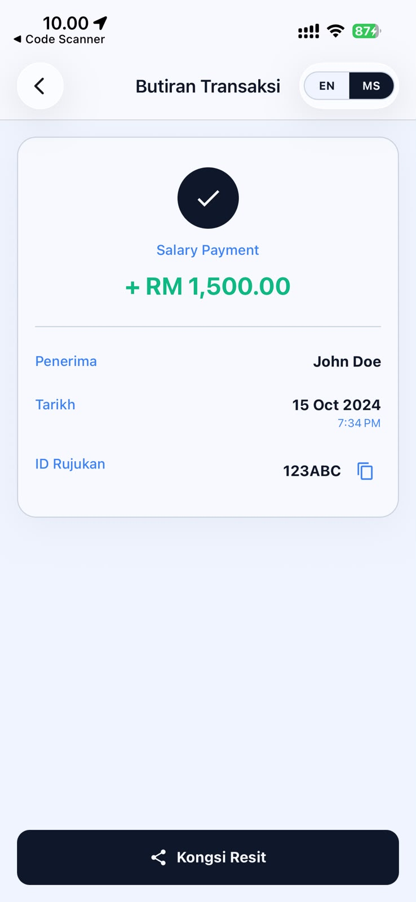
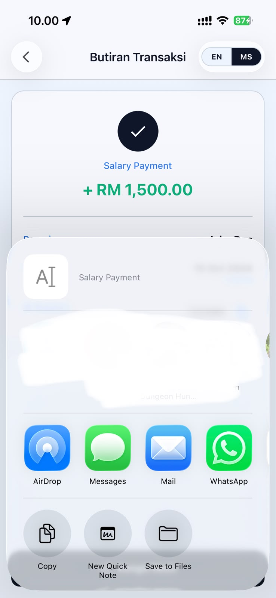

# AEON Bank Transaction MVP

This project is a small React Native banking app built with Expo Router for an AEON Bank mobile engineering assessment. The app focuses on a tight transaction-review flow: load recent transfers, search and filter them, open a receipt-style detail screen, copy the reference ID, and share the receipt externally.

The implementation is intentionally lightweight, but still structured like a maintainable product codebase. Screen-specific logic lives in hooks, reusable UI stays in `components/`, transaction data flows through Zustand, and platform features such as clipboard and share are wrapped behind small utilities.

## Screenshots

<table>
  <tr>
    <td align="center"><strong>Transactions - English</strong></td>
    <td align="center"><strong>Transactions - Bahasa Malaysia</strong></td>
  </tr>
  <tr>
    <td></td>
    <td></td>
  </tr>
  <tr>
    <td align="center"><strong>Transaction Detail - English</strong></td>
    <td align="center"><strong>Transaction Detail - Bahasa Malaysia</strong></td>
  </tr>
  <tr>
    <td></td>
    <td></td>
  </tr>
  <tr>
    <td align="center"><strong>Native Share Flow</strong></td>
    <td></td>
  </tr>
  <tr>
    <td></td>
    <td></td>
  </tr>
</table>

## MVP Scope

The MVP is centered on the most useful transaction journey:

```text
Open app
  |
  v
Review recent transactions
  |
  +-- Search transactions
  +-- Filter all / incoming / outgoing
  +-- Pull to refresh
  |
  v
Open transaction detail
  |
  +-- Copy reference ID
  +-- Share receipt
```

This repo does not yet include authentication, real backend integration, PDF generation, or automated tests. Those are reasonable next steps, but they are intentionally outside the current MVP boundary.

## Features

- Transaction list sorted by latest transfer date.
- Sectioned transaction list grouped by transfer month.
- 300ms debounced search.
- Transaction type filter: `All`, `Incoming`, `Outgoing`.
- Pull-to-refresh on the transaction list.
- Loading, empty, no-result, and error states.
- Receipt-style transaction detail screen.
- Copy reference ID to clipboard.
- Toast/alert confirmation after copy.
- Native share flow using the platform share sheet.
- English and Bahasa Malaysia dictionaries.
- Header language switcher with persisted preference.
- Light and dark theme support based on system color scheme.
- Mock service layer with simulated API delay.
- Strict TypeScript configuration.

## Tech Stack

- Expo SDK 54
- React Native 0.81
- Expo Router
- TypeScript (`strict: true`)
- Zustand
- AsyncStorage persistence
- Expo Clipboard
- React Navigation theme integration
- ESLint (Expo config)

## Architecture

The app follows a simple screen-hook-store flow that fits React Native well.

```text
app/ routes
  |
  v
screen components
  |
  v
screen hooks
  |
  v
zustand stores
  |
  v
services / mock data / utils
```

### Routing

The app currently exposes only two routes:

- `app/index.tsx` -> transaction list
- `app/detail.tsx` -> transaction detail

Navigation is handled with Expo Router, and only the `refId` is passed to the detail screen.

### State Management

There are two Zustand stores:

- `store/transaction-store.ts`
  - fetches list and detail data
  - tracks loading and error state
  - persists cached transactions
  - groups transactions for the list UI
- `store/preferences-store.ts`
  - stores the selected language (`en` / `ms`)

### Screen Pattern

Each feature screen keeps its view composition separate from its state logic:

```text
screens/
  transaction-list/
    transaction-list.screen.tsx
    transaction-list.hook.ts
    transaction-list-item.tsx
    transaction-section-header.tsx
    transaction-list.style.ts

  detail-transaction/
    transaction-detail.screen.tsx
    transaction-detail.hook.ts
    transaction-detail-row.tsx
    transaction-detail.style.ts
```

### Services and Utilities

- `services/transaction.service.ts`
  - reads from mock transaction data
  - simulates API latency with an 800ms delay
- `utils/share.ts`
  - wraps the native share flow
- `utils/clipboard.ts`
  - wraps Expo Clipboard
- `utils/toast.ts`
  - shows Android toast / iOS alert feedback
- `utils/currency.ts`
  - formats transaction amounts for display

## Current Project Structure

```text
app/
components/
hooks/
i18n/
mock/
screens/
services/
store/
theme/
types/
utils/
assets/images/
```

Notable reusable components:

- `AppButton`
- `SearchInput`
- `FilterGroup`
- `EmptyState`
- `AmountText`
- `HeaderLanguageSwitcher`

## Data Flow

```text
mock/transaction-mock.ts
  |
  v
transaction.service.ts
  |
  v
transaction-store.ts
  |
  +-- sort by latest date
  +-- group by month
  |
  v
transaction-list.hook.ts
  |
  +-- debounce query
  +-- filter by keyword
  +-- filter by transaction type
  |
  v
transaction-list.screen.tsx
```

For detail:

```text
Transaction row press
  |
  v
/detail?id=<refId>
  |
  v
transaction-detail.hook.ts
  |
  v
transaction-store.fetchTransactionDetail(refId)
  |
  v
transaction-detail.screen.tsx
```

## Localization and Theming

Localization uses a lightweight dictionary-based approach:

- `i18n/en.ts`
- `i18n/ms.ts`

The selected language is stored in `preferences-store.ts` and exposed through `useTranslation()`.

Theming is system-aware and token-based:

- `theme/colors.ts`
- `theme/typography.ts`
- `hooks/use-app-theme.ts`

The root layout applies the active palette to React Navigation through `ThemeProvider`.

## Mock Data Notes

The current mock dataset is intentionally small and simple so the assessment flow is easy to review:

- 4 transactions
- mixed incoming and outgoing amounts
- list + detail fetch simulated through service functions

This makes it easy to replace the mock layer later with a real API without rewriting the screen layer.

## Setup

Install dependencies:

```bash
npm install
```

## Run the App

Start the Expo development server:

```bash
npm start
```

You can then open the app in:

- Expo Go
- Android emulator
- iOS simulator
- web preview

Other useful commands:

```bash
npm run android
npm run ios
npm run web
```

## Quality Checks

Lint the project:

```bash
npm run lint
```

Run TypeScript verification:

```bash
npx tsc --noEmit
```

## Engineering Notes

Some implementation choices worth calling out:

- Search is debounced with `useDebounce` to avoid filtering on every keystroke.
- Grouped section data is also available from the store, with a hook fallback to regroup raw transactions if needed.
- Clipboard and share interactions are kept out of the screen JSX as much as possible through utility helpers.
- Only long-lived useful state is persisted; loading and error state remain runtime-only.

## Limitations

The current repo intentionally does not include:

- real API integration
- authentication / session handling
- exact date range filter
- PDF receipt export
- biometric security
- automated unit/component/E2E tests

## Future Improvements

- Replace mock service with real API integration.
- Expand mock data to include denser real-world transaction descriptions.
- Add date-range filtering and richer search matching.
- Add automated tests for store logic and screen behavior.
- Improve receipt sharing format with richer localized content.
- Add secure session handling and biometric authentication.

## Conclusion

This project keeps the AEON Bank transaction journey focused and reviewable: open the app, find the right transaction quickly, inspect the receipt-style detail, copy the reference ID, and share the result through the native platform flow.

The codebase is intentionally modest in scope, but it already has the right extension points for a larger product: reusable components, typed hooks, centralized stores, mock-backed services, and system-aware localization and theming.
